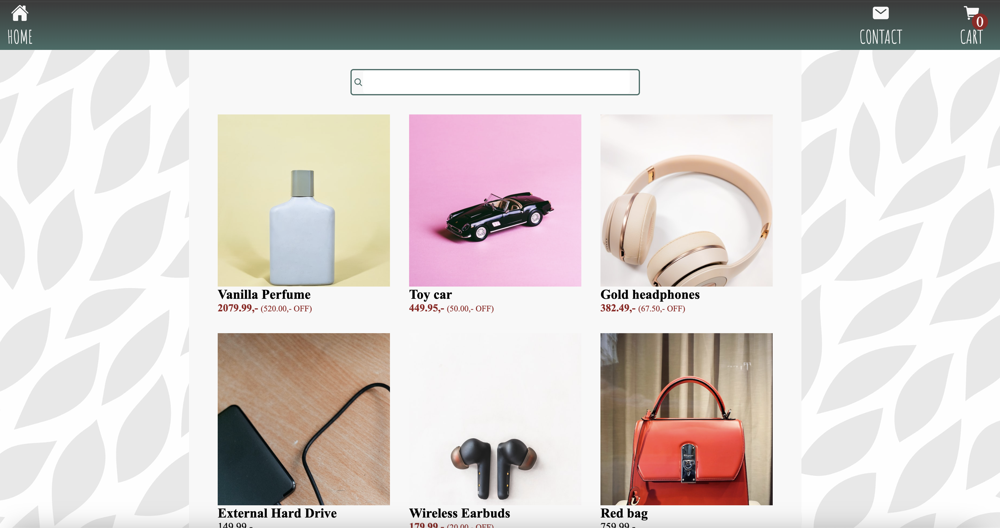

# JavaScript Frameworks CA, eCOM



## Deployment

 https://javascript-frameworks-react-ca.netlify.app/

## Description

You are tasked with build out the following pages for an eCom store:

- Homepage
- Individual product page
- Cart page
- Checkout success page
- Contact page

The Homepage should have a list of all the products. There should be a look-ahead search bar that filters products when typing in a product name. Clicking on a product should take a user to an individual product page.

The individual product page should display data for a single product. There should be an Add to cart button which, upon clicking, adds the product to the cart. The product page should display the title of the product, the description and the image. There should also be reviews listed for the product, if there are any. You should use the discountedPrice property to display the price of the product. If there is a difference between the discountedPrice and price properties then that means there is a discount for that product. Calculate what this discount is and display it on the page.

Clicking on the Cart icon will load the Cart page, which will list all of the products as well as a total. The Cart page will have a Checkout button. Clicking this Checkout button then goes to a Checkout success page.

The Checkout success page will display a message to the user notifying them that their order was successful. There should also be a link that lets a user go back to the store. The cart must be cleared if the user gets to the Checkout success page.

There will be a contact page which will contain a contact form with the following fields. There must be form validation:
Full name (Minimum number of characters is 3, required)
Subject (Minimum number of characters is 3, required)
Email (Must be a valid email address, required)
Body (Minimum number of characters is 3, required)

## Built With

- [React](https://react.dev/)
- [React-Router-DOM](https://reactrouter.com/en/main)
- [Zustand](https://docs.pmnd.rs/zustand/)

<div>
  &nbsp;
  &nbsp;
</div>

## API

API Documentation: https://docs.noroff.dev/docs/v2/basic/online-shop
API Swagger: https://v2.api.noroff.dev/docs/static/index.html

## Getting Started

### Installing

1. Clone the repo:

```
https://github.com/karolina-szymanska/javascript-frameworks-ca
```

2. Install the dependencies:

```
npm install
```

### Running

1. Install dependencies

```
npm i
```

2. Start Application

```
npm run start
```

## Contact

[](https://www.linkedin.com/in/karolina-szyma%C5%84ska-64b36089/)

[](https://github.com/karolina-szymanska)

[](mailto:karolinaszymanska899@gmail.com)

## Acknowledgments

[Noroff - School of technology and digital media](https://www.noroff.no/)
